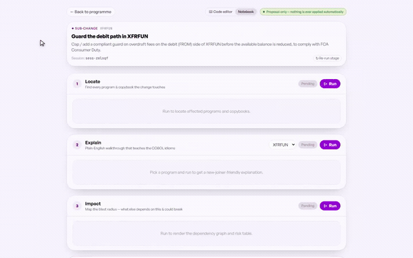
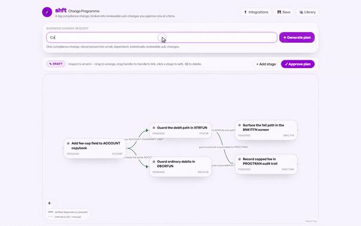
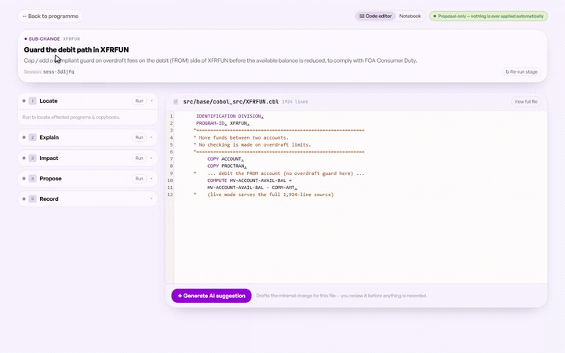
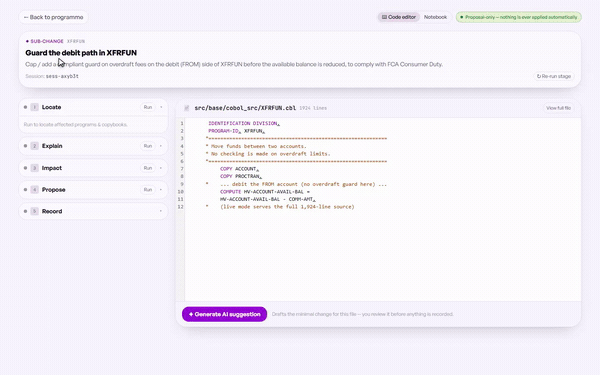
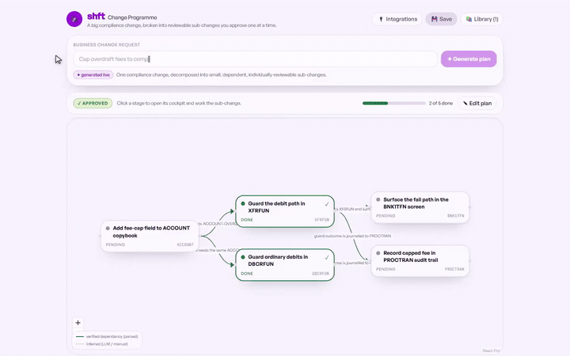

# shft — AI Change Cockpit for Legacy COBOL

A human-in-the-loop agent that lets a *new-joiner engineer* safely make a business-driven
change to a legacy COBOL banking system: it **locates** every affected program/copybook,
**explains** each in plain English, maps the **impact** (blast radius), **proposes** the exact
edit as a reviewable diff, and **records** every approved step to a tamper-evident ledger —
executing only what the human approves.

> Worked example: *"Cap / add a compliant guard on overdraft fees to comply with FCA Consumer
> Duty."* On the CBSA corpus the overdraft limit lives on the ACCOUNT record but is **not
> enforced** on the transfer/debit path (`XFRFUN`/`DBCRFUN`), so the honest fix is to ADD a
> guard — the tool reasons about the *absence* of logic.

## See it work

shft turns a business change into a **governed, provable** engineering change: the AI proposes, a named human approves, and a tamper-evident ledger proves it. The clips below are a developer working a real FCA Consumer Duty change end-to-end on IBM's open CBSA COBOL corpus — **plan → understand → change → prove → oversee**, with a human in control at every gate.

<p align="center">
  
</p>

---

### 1 · Describe → decompose

You type the change in plain English — *"cap overdraft fees to comply with FCA Consumer Duty"* — and shft decomposes the request into a small graph of dependent sub-changes on one screen, then grades every edge against the actual parsed source: **verified** when it's a real `COPY`/`CALL` relationship (solid green), or **inferred** when it's the AI's ordering, or a link you add by hand (dashed gold). You always know which is which. The plan opens as a **draft** — drag to rearrange, rename or reword any node — and **nothing runs until you approve it**. The machine proposes; the person disposes.

<p align="center"></p>

### 2a · Understand — Locate · Explain · Impact

Open a sub-change and the cockpit reads the code the way a retiring COBOL veteran would — before they walk out the door with it in their head. **Locate** finds every affected program and copybook, each tagged verified against the parsed field index. **Explain** walks the old COBOL in plain English and teaches the idioms in play — the onboarding a new joiner never gets. **Impact** maps the blast radius over the parsed dependency graph — every program reachable through a resolved `COPY`/`CALL`/CICS edge — and, in the editor, highlights the *culprit* lines that reference the fields this change concerns. All of it grounded in the parsed source — not guessed.

<p align="center"></p>

### 2b · Change, human-gated — Propose

shft drafts the smallest possible edit and applies it **inline as a review diff** in the editor — accept the AI's hunk in the gutter, edit the code by hand, or reject it outright. But it records nothing on its own. A named engineer must type a **justification** and sign — the one gate the whole product is built around. There is no deploy button. The engineer's justification is hash-chained together with the diff — the reasoning, not just the change, becomes part of the record.

<p align="center"></p>

### 2c · Prove it — Record & the tamper-evident ledger

Every approval — the change, the person, the reason, the timestamp — is sealed into a tamper-evident ledger, each record cryptographically locked to the one before it (a SHA-256 hash chain over RFC-8785 canonical JSON). Most audit trails are a promise; this one is a **proof**. Tamper with a single recorded entry and **Verify fails — visibly, immediately** — pointing at the exact broken record. For a Senior Manager personally accountable under UK law, that's the difference between *"we believe we took reasonable steps"* and *"here is the evidence that we did."*

<p align="center"></p>

### 3 · The trail — programme, library & integrations

Back at the programme, worked sub-changes light up **done** and the progress bar advances; the full hash-chained audit trail sits below, exportable as a **Senior-Manager evidence pack**. Save a programme to your library to pick it up later, and see how shft works with your workflow — Slack notifications today (a deep link only; approval itself stays in the cockpit, by design), with Jira, ServiceNow, GitHub, email digests and MS Teams on the roadmap. Notification is cheap; accountability is not.

<p align="center"></p>

<sub>The clips are muted, autoplaying GIFs. Full-resolution MP4s of each are in <a href="docs/media/"><code>docs/media/</code></a> — for a click-to-play inline player, drag an MP4 into a GitHub comment/issue and paste the generated <code>user-attachments</code> URL (GitHub strips autoplay from committed <code>&lt;video&gt;</code> tags, which is why the loops above are GIFs). Recorded against the bundled mock provider — deterministic, no backend required.</sub>

See **`Claude.MD`** for the full spec, frozen contracts (§8), and landmine map (§14).

## Status — Phase 0 complete (mock end-to-end, twice-cold)

The whole flow runs end-to-end on the **mock provider** (`USE_MOCK_LLM=1`, no API key), twice
in a row with no restart: `Locate → Explain → Impact → Propose ─[human gate]─ Approve → Record →
Verify`, including the interrupt/resume round-trip and ledger tamper-detection. Swapping in a
Claude API key (`USE_MOCK_LLM=0`, `ANTHROPIC_API_KEY=…`) lights up the real LLM with zero code
changes (the whole point of the provider abstraction).

## Architecture

```
Plain-English change request
   │
   ▼  [router]  free-text → intent + seed symbols   (never keyword→program)
   ▼  [DETERMINISTIC COBOL GRAPH]  analysis/cobol.py — parsed COPY/CALL edges, verified|inferred
   ▼  6 graph nodes (LangGraph + AsyncSqliteSaver checkpointer):
        locate → explain → impact → propose ─[interrupt]─ approve → record
                                     (propose+approve split so the diff is generated once, L2)
   ▼  tamper-evident ledger (RFC 8785 canonical JSON, SHA-256 hash chain, domain-sep Merkle)
```

| Dir | Track | What |
|---|---|---|
| `schema.py`, `agent/`, `llm/`, `analysis/` | A | frozen contract, 6-node graph, provider abstraction, dependency-graph spine |
| `server/` | B | async FastAPI, graph compiled in `lifespan`, `§8.2` endpoints |
| `web/` | C | Vite + React + Tailwind notebook (5 cells, verified/inferred badges, approval gate, ledger) |
| `ledger/`, `chain/` | D | hash-chain ledger + verify + tamper; on-chain anchor (Tier 3, stub) |

## Run it

```bash
# 0) once: create the venv + deps, fetch the corpus
python -m venv .venv
.venv/Scripts/python -m pip install -r requirements.txt      # (Windows path; use .venv/bin on *nix)
bash scripts/fetch_corpus.sh                                  # CBSA tag 2026Q1 → corpus/cbsa

# 1) backend (mock — no key needed)
USE_MOCK_LLM=1 .venv/Scripts/python -m uvicorn server.main:app --port 8000
#    real Claude instead:  USE_MOCK_LLM=0 ANTHROPIC_API_KEY=... LLM_MODEL=claude-sonnet-5 uvicorn server.main:app ...

# 2) frontend
cd web && npm install && npm run dev            # http://localhost:5173  (mock data by default)
#    to drive the LIVE backend:  set VITE_USE_MOCK=false in web/.env, then npm run dev
```

Quick backend self-test (drives the whole flow over HTTP, twice):

```bash
.venv/Scripts/python scripts/drive.py 2
```

## Corpus

IBM CBSA (`cicsdev/cics-banking-sample-application-cbsa`, tag **2026Q1**, EPL-2.0):
29 programs in `src/base/cobol_src/`, 37 copybooks in `src/base/cobol_copy/`. The COBOL is
**never executed** — static comprehension only.
